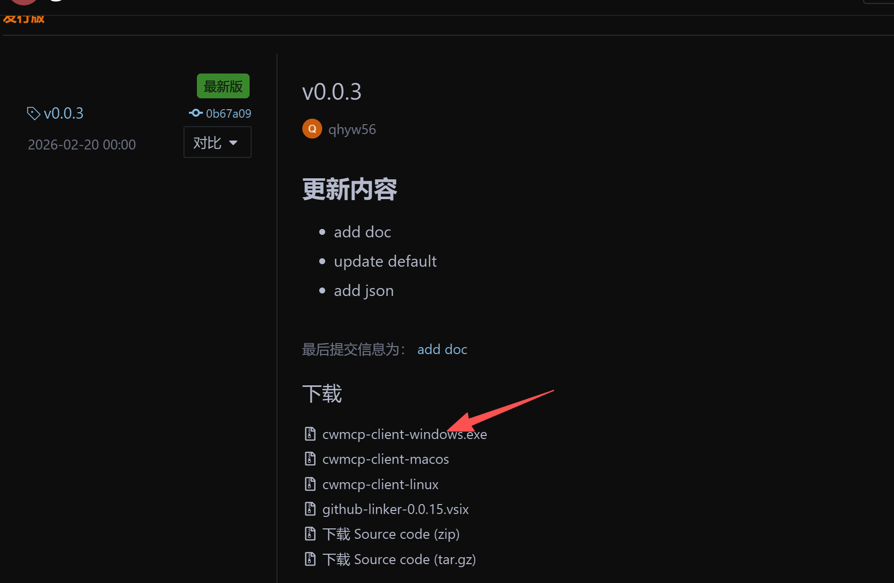
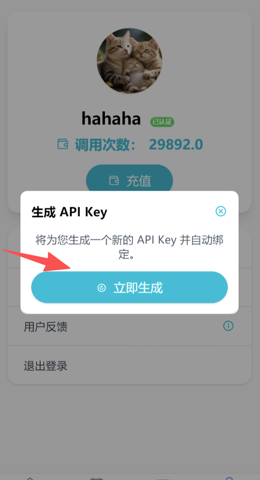
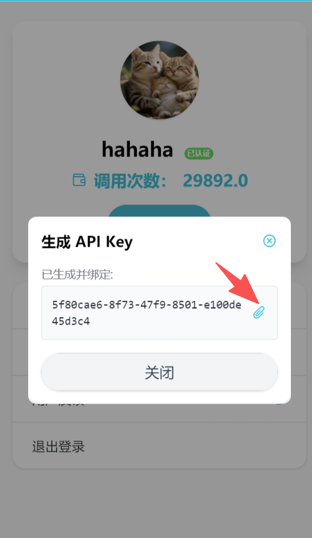
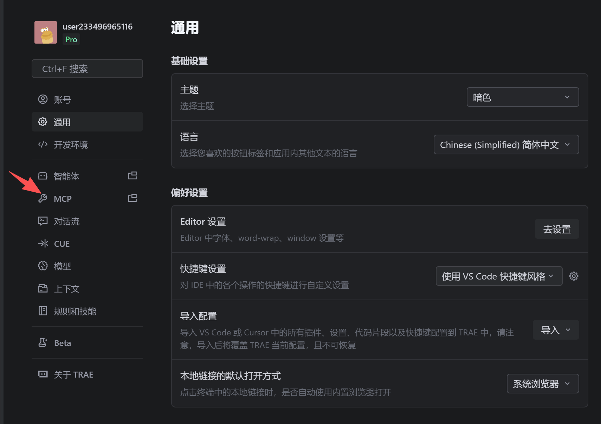
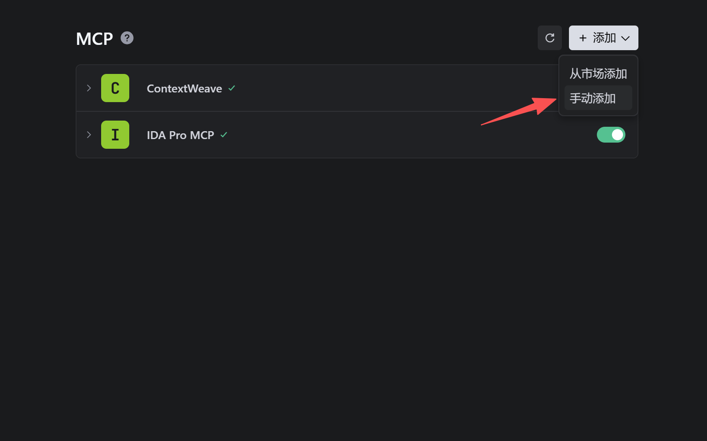
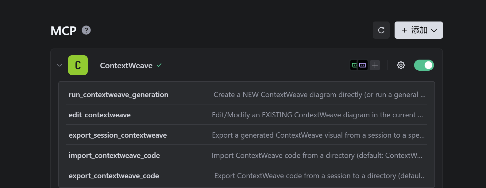
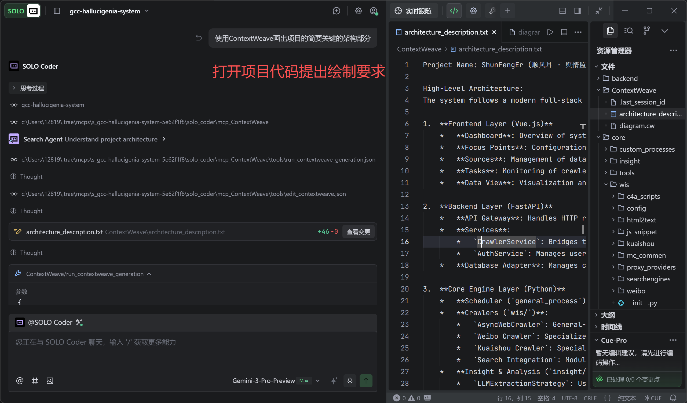
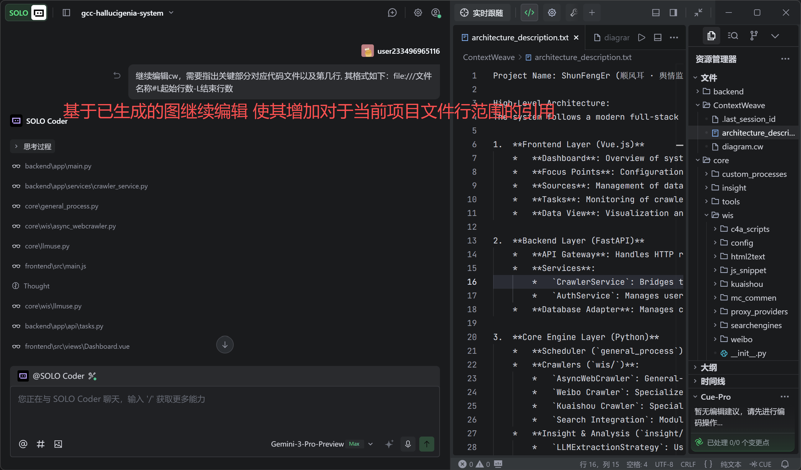
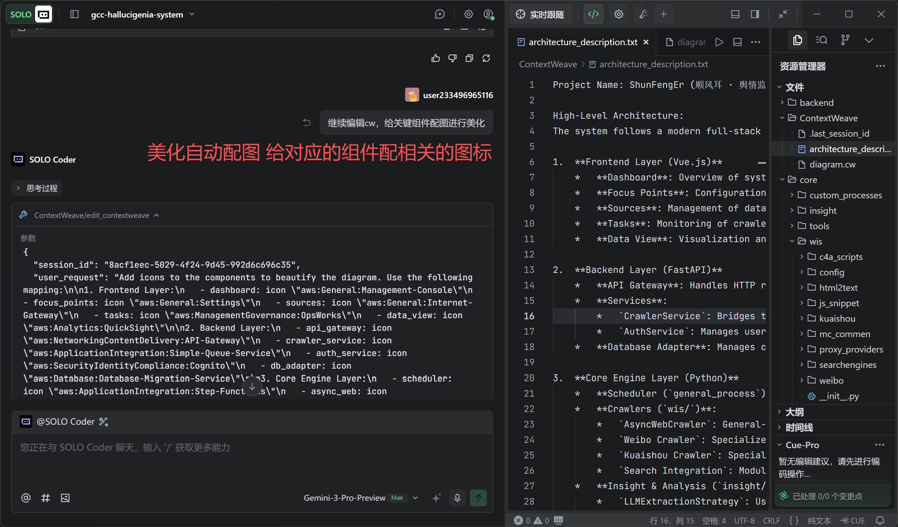
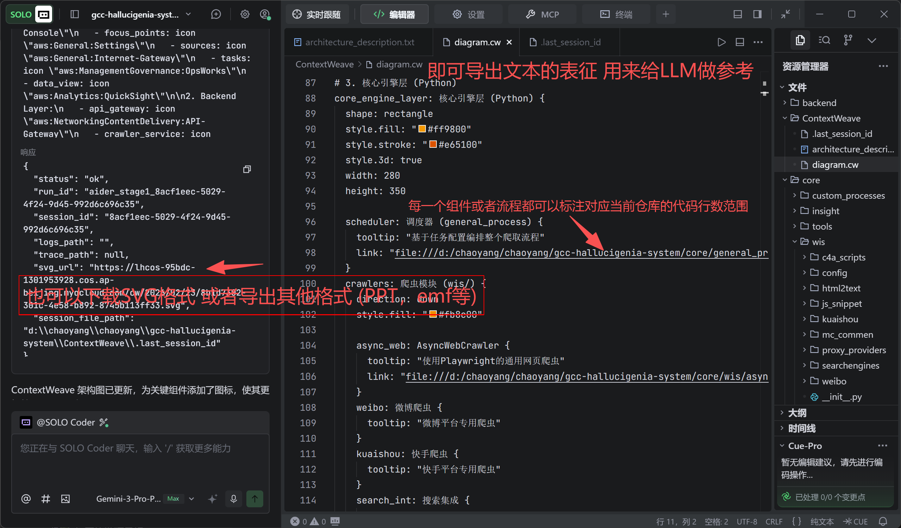

## ContextWeave MCP 配置指南

本指南将帮助您在 Trae 等编程工具中配置 ContextWeave MCP 服务。
### 第0步：下载二进制文件

1. 访问 [ContextWeave MCP 客户端下载页面](https://gitee.com/qhyw56/cwmcp-client/releases)。
2. 下载适用于您操作系统的二进制文件（如 `cwmcp-client-windows.exe`）。

3. 将二进制文件保存到您方便访问的目录，例如 `D:\cwmcp-client-windows.exe`。

### 第一步：获取 API Key

1. 扫描下方小程序码。

2. 进入“我的账户”页面。
3. 点击“生成 API key”按钮。

4. 点击复制生成的 API Key。



### 第二步：配置 MCP 服务

1. 打开编程工具（如 Trae）。
2. 进入设置页面，点击 **MCP** 选项卡。
   
3. 点击“手动添加”按钮。
4. 在弹出的对话框中，输入下方的 JSON 配置代码。
   

### 第三步：填入 API Key

将第一步中获取的 API Key 填入 JSON 配置中的 `CONTEXTWEAVE_MCP_API_KEY` 字段（替换 `94a05d02-9ade-4d9d-9f39-xxxxxx`）。

**ContextWeave MCP JSON 配置：**

```json
{
  "mcpServers": {
    "ContextWeave": {
      "command": "D:\\cwmcp-client-windows.exe",
      "args": [],
      "env": {
        "CONTEXTWEAVE_MCP_API_KEY": "94a05d02-9ade-4d9d-9f39-xxxxxx"
      }
    }
  }
}
```
"command"里的地址"D:\\cwmcp-client-windows.exe"需要同二进制文件的地址一致。
### 第四步：验证配置

点击确认后，如果出现如下截图所示的状态，即表示添加成功。


使用截图如下：

1.生成ContextWeave代码

2.在现有上下文中编辑ContextWeave代码

3.导出ContextWeave代码文本

4.下载ContextWeave SVG(或pptx)

